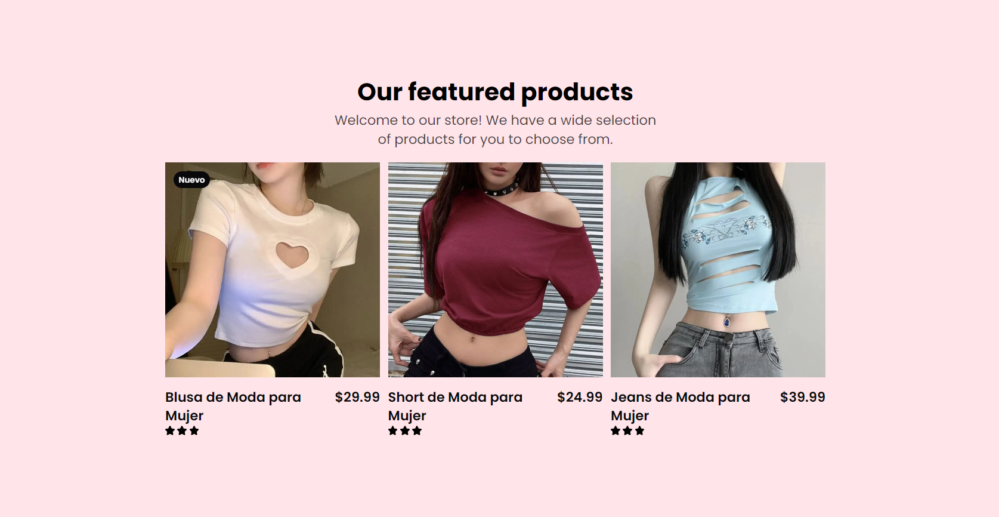

# Items Products

Este proyecto es una tienda en línea que muestra una selección de productos destacados utilizando Astro y Tailwind CSS.

## Vista Previa



## Instalación

1. Clona el repositorio:
    ```sh
    git clone <URL_DEL_REPOSITORIO>
    ```
2. Navega al directorio del proyecto:
    ```sh
    cd items-products
    ```
3. Instala las dependencias:
    ```sh
    npm install
    ```

## Scripts

- `dev`: Inicia el servidor de desarrollo.
    ```sh
    npm run dev
    ```
- `build`: Construye el proyecto para producción.
    ```sh
    npm run build
    ```
- `preview`: Previsualiza el proyecto construido.
    ```sh
    npm run preview
    ```

## Descripción de Archivos

- [Welcome.astro](http://_vscodecontentref_/26): Componente principal que muestra la bienvenida y los productos destacados.
- [Items.astro](http://_vscodecontentref_/27): Componente que obtiene y muestra los productos.
- [CardItem.astro](http://_vscodecontentref_/28): Componente que muestra la información de un producto individual.
- [Layout.astro](http://_vscodecontentref_/29): Layout principal del proyecto.
- [config.ts](http://_vscodecontentref_/30): Configuración de la colección de productos.
- [products](http://_vscodecontentref_/31): Directorio que contiene los archivos Markdown de los productos.

## Licencia

Este proyecto está licenciado bajo la Licencia MIT.